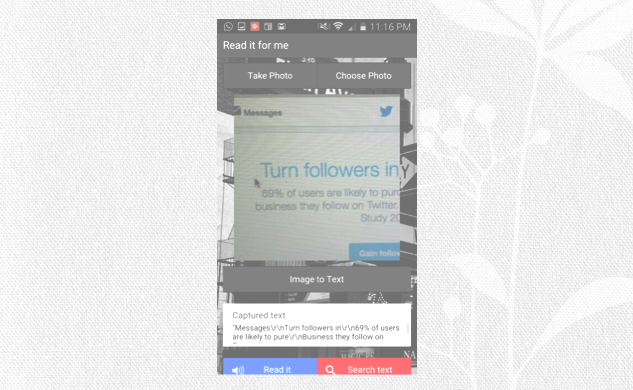

# IT485-ResearchActivity

## Project description
The purpose of this activity is to explore capabilities of mashup application, that uses content from more than one web API. This application is a mobile app using hybrid mobile app framework, Ionic Framework. It is intended to be used by people who are not familiar with English, such as tourists. Using the application, users will take a picture of letters(signs on the street for example) they want to know how to read and its meaning.
When an image is captured and the application receives it, the image is sent to optical character recognition API and it returns the text to the application.
Secondly, the text is sent to another API which is Text-to-speech API, and the API returns an audio file(MPS) in response. Additionally the meaning of the text is requested from the application to a DuckDuckGo Instant Answer API and returns related information and description about the terms.

## Selected tools, technologies & frameworks
* [Ionic framework](http://ionicframework.com/)
* [AngularJS](https://angularjs.org/)
* HTML
* Javascript
* jQuery
* CSS
* [Ocr Api Service](http://ocrapiservice.com/)
* [Voice RSS](http://www.voicerss.org/)
* [DuckDuckGo Instant Answer API](https://duckduckgo.com/api)
